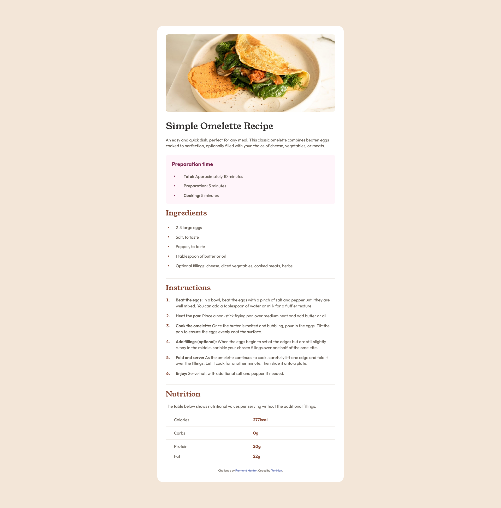

# Frontend Mentor - Recipe page solution

This is a solution to the [Recipe page challenge on Frontend Mentor](https://www.frontendmentor.io/challenges/recipe-page-KiTsR8QQKm).

## Table of contents

- [Overview](#overview)
  - [The challenge](#the-challenge)
  - [Screenshot](#screenshot)
  - [Links](#links)
- [My process](#my-process)
  - [Built with](#built-with)
  - [What I learned](#what-i-learned)
- [Author](#author)

## Overview

### Screenshot

### Links

- Solution URL: [GitHub](https://github.com/TIKOsup/recipe-page)
- Live Site URL: [Netlify](https://recipe-page-4ads7f.netlify.app)

## My process

### Built with

- Semantic HTML5 markup
- CSS custom properties
- Flexbox
- Mobile-first workflow

### What I learned

While working on this page, I refreshed my knowledge of pure HTML and CSS. I had to spend more time on the HTML pseudo-element `::marker` when styling `<ul>` and `<ol>` since I hadn't done that before.

## Author

- GitHub - [TIKOsup](https://github.com/TIKOsup)
- Frontend Mentor - [TIKOsup](https://www.frontendmentor.io/profile/TIKOsup)